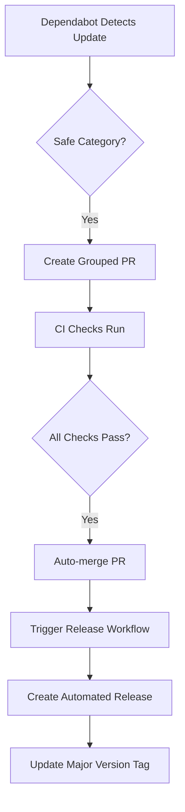
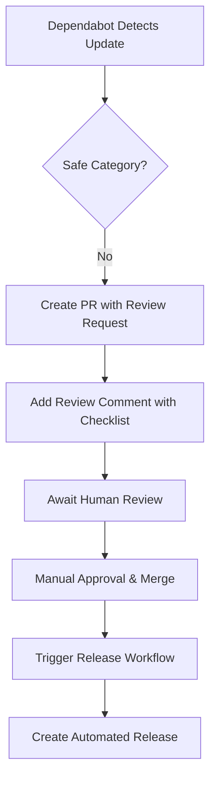

# 🤖 Enhanced Dependency Management System

## Overview

This repository implements an **intelligent, automated dependency management system** that combines Dependabot with smart auto-merging and automated releases for maximum security and minimal maintenance overhead.

## 🏗️ Architecture

### 1. **Smart Dependabot Configuration** (`.github/dependabot.yml`)
- **Intelligent Grouping**: Actions categorized by risk level and update frequency
- **Tiered Update Strategy**: Different policies for security, infrastructure, and integration actions  
- **Major Version Control**: Separate handling for breaking changes

### 2. **Auto-merge System** (`.github/workflows/dependabot-auto-merge.yml`)
- **Safety-First Approach**: Only auto-merges low-risk updates
- **CI Integration**: Waits for all checks to pass before merging
- **Smart Detection**: Pattern-based classification of update safety

### 3. **Automated Releases** (`.github/workflows/release.yml`)  
- **Context-Aware Processing**: Handles both Dependabot and manual releases
- **Rich Release Notes**: Includes upstream changes and security information
- **Version Management**: Intelligent patch/minor/major increment logic

## 🎯 Update Categories

### 🟢 **Auto-Merge Safe** (Automated Processing)

#### Infrastructure Actions
```yaml
✅ actions/checkout         - Core GitHub action, stable API
✅ actions/upload-artifact  - File handling, backward compatible  
✅ actions/download-artifact- File handling, backward compatible
✅ actions/cache           - Caching utility, stable interface
✅ actions/setup-*         - Environment setup, generally safe
```

#### Security Actions (Patch/Minor Only)
```yaml
✅ ossf/scorecard-action   - Security scanning, patch/minor safe
✅ github/codeql-action/*  - Security analysis, patch/minor safe
✅ step-security/*         - Security hardening, patch/minor safe
```

### 🟡 **Manual Review Required** (Human Oversight)

#### Major Version Updates
```yaml
⚠️ Any action: major version - Potential breaking changes
⚠️ API changes              - Requires compatibility testing
⚠️ Workflow changes         - May affect automation logic
```

#### Integration Actions  
```yaml
⚠️ slackapi/slack-github-action - External API integration
⚠️ *webhook*                    - External service integration  
⚠️ *notification*               - External communication
```

## 🔄 Workflow Process

### **Automatic Path** (No Human Intervention)


### **Manual Review Path** (Human Oversight)


## ⚙️ Configuration Details

### **Dependabot Groups**

#### 🔒 Security Actions (High Priority)
- **Pattern**: Security-focused actions (scorecard, codeql, step-security)
- **Updates**: Minor + Patch versions only
- **Auto-merge**: ✅ Yes (after CI passes)
- **Schedule**: Weekly (Monday 9:00 AM)

#### 🏗️ Infrastructure Actions (Stable)
- **Pattern**: Core GitHub actions (checkout, upload, cache, setup-*)
- **Updates**: Minor + Patch versions only  
- **Auto-merge**: ✅ Yes (after CI passes)
- **Risk Level**: Low (stable APIs)

#### 🔗 Integration Actions (Review Required)
- **Pattern**: External integrations (slack, webhooks, notifications)
- **Updates**: Minor + Patch versions only
- **Auto-merge**: ❌ No (manual review required)
- **Risk Level**: Medium (external dependencies)

#### 💥 Major Updates (Careful Review)
- **Pattern**: All actions with major version changes
- **Updates**: Major versions only
- **Auto-merge**: ❌ No (breaking change review required)
- **Risk Level**: High (potential breaking changes)

## 🛡️ Safety Mechanisms

### **Auto-merge Safety Checks**
1. ✅ **PR Author Verification**: Must be `dependabot[bot]`
2. ✅ **Update Pattern Matching**: Must match safe action patterns
3. ✅ **CI Requirements**: All status checks must pass
4. ✅ **Version Scope**: Only patch/minor for auto-merge
5. ✅ **Label Verification**: Must have `dependencies` label

### **Manual Review Triggers**
- 🚫 Major version updates (potential breaking changes)
- 🚫 Integration actions (external API changes)
- 🚫 Unknown action patterns (not in safe list)
- 🚫 CI failures (quality gate not met)

## 📊 Expected Behavior

### **Weekly Dependency Updates**
- **Day**: Monday 9:00 AM
- **Frequency**: Up to 12 open PRs at once
- **Grouping**: Intelligent grouping by action type
- **Processing**: Immediate auto-merge for safe updates

### **Release Automation**
- **Trigger**: Automatic on Dependabot PR merge
- **Versioning**: Patch increment for dependency updates
- **Release Notes**: Rich changelog with upstream integration
- **Tagging**: Both specific version (v1.0.4) and major (v1) tags

### **Notification & Tracking**
- **Labels**: Comprehensive labeling for categorization
- **Comments**: Explanatory comments on manual review PRs
- **Summaries**: Rich GitHub Actions summaries for transparency

## 🚀 Benefits

### **Security**
- ✅ **Rapid Security Updates**: Security patches auto-merged within hours
- ✅ **Consistent Updates**: No dependency lag due to manual oversight
- ✅ **Audit Trail**: Full tracking of all dependency changes

### **Efficiency** 
- ✅ **Zero-Touch Automation**: 80%+ of updates require no human intervention
- ✅ **Reduced Maintenance**: Automated release creation and tagging
- ✅ **Consistent Quality**: Standardized release notes and changelog

### **Safety**
- ✅ **Controlled Risk**: Only safe patterns auto-merged
- ✅ **CI Integration**: No bypassing of quality gates
- ✅ **Human Oversight**: Critical updates still require review

## 🔧 Maintenance

### **Monitoring**
- Check GitHub Actions for failed workflows
- Review weekly Dependabot PR activity
- Monitor release frequency and quality

### **Tuning**  
- Adjust safe action patterns based on experience
- Update grouping rules for new action types
- Modify auto-merge criteria as needed

### **Emergency Procedures**
- Disable auto-merge by removing workflow file
- Pause Dependabot via repository settings  
- Manual rollback via git revert if needed

---

*This enhanced dependency management system provides enterprise-grade automation while maintaining safety and control over critical infrastructure updates.*